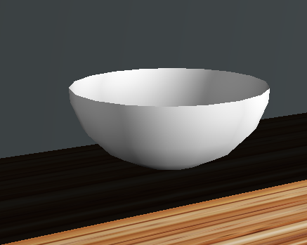

# javafx-shape3d

A library of extra 3D shapes and utilities for javafx.

 * **Spheroid**: For plotting spheroids and hemi-spheroids, sub-classes of ellipsoids. A use case for this was a bowl shown above.
 * **CuboidMeshBuilder**: A utility for building a JavaFX TriangleMesh and hence a 3D shape, from a series of smaller cuboids.
 * **BoxWithCutout**: An example usage of CuboidMeshBuilder, a box with a rectangular cut out in it. The use case for this was modelling a worktop with a cut out for a sink.
 * **Stack3D**: A layout container for 3D shapes which aligns incoming shapes relative to the current contents.
